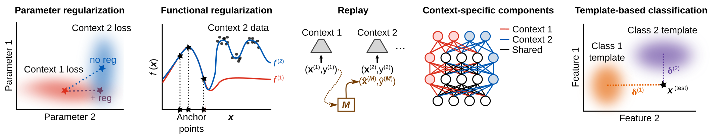
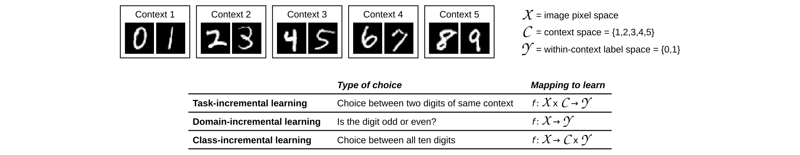
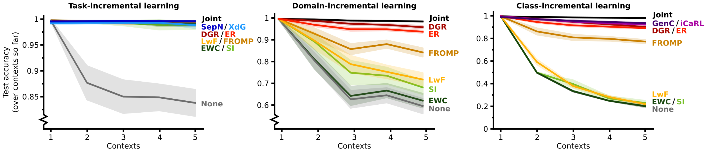

# NeurIPS tutorial "Lifelong Learning Machines"
The code in this repository is used as part of the
[NeurIPS 2022 tutorial "Lifelong Learning Machines"](https://sites.google.com/view/neurips2022-llm-tutorial).

In Part 2a of the tutorial, an overview is provided of currently used strategies for continual learning.
In this overview, following 
[van de Ven et al. (2022, *Nature Machine Intelligence*)](https://www.nature.com/articles/s42256-022-00568-3),
five computational strategies for continual learning are distinguished:



To illustrate the relative strengths and weaknesses of these different computational strategies,
an empirical comparison is performed in which for each strategy two representative examples methods are included:
- ***Parameter regularization***
  - Elastic weight consolidation (<span style="color:darkgreen">**EWC**</span>;
    [Kirkpatrick et al, 2017 *PNAS*](https://www.pnas.org/doi/10.1073/pnas.1611835114))
  - Synaptic Intelligence (<span style="color:green">**SI**</span>;
    [Zenke et al., 2017 *ICML*](http://proceedings.mlr.press/v70/zenke17a))
- ***Functional regularization***
  - Learning without forgetting (<span style="color:gold">**LwF**</span>;
    [Li & Hoiem, 2017 *TPAMI*](https://ieeexplore.ieee.org/abstract/document/8107520))
  - Functional Regularization of the Memorable Past (<span style="color:darkorange">**FROMP**</span>;
    [Pan et al., 2020 *NeurIPS*](https://proceedings.neurips.cc/paper/2020/hash/2f3bbb9730639e9ea48f309d9a79ff01-Abstract.html))
- ***Replay***
  - Deep Generative Replay (<span style="color:darkred">**DGR**</span>;
    [Shin et al., 2017 *NeurIPS*](https://proceedings.neurips.cc/paper/2017/hash/0efbe98067c6c73dba1250d2beaa81f9-Abstract.html))
  - Experience Replay (<span style="color:red">**ER**</span>;
    [Chaudhry et al., 2019 *arXiv*](https://arxiv.org/abs/1902.10486))
- ***Context-specific components***
  - Separate Networks (<span style="color:darkblue">**SepN**</span>)
  - Context-dependent Gating (<span style="color:skyblue">**XdG**</span>;
    [Masse et al., 2018 *PNAS*](https://www.pnas.org/doi/abs/10.1073/pnas.1803839115))
- ***Template-based classification***
  - Generative Classifier (<span style="color:indigo">**GenC**</span>;
    [van de Ven et al., 2021 *CVPR-W*](https://openaccess.thecvf.com/content/CVPR2021W/CLVision/html/van_de_Ven_Class-Incremental_Learning_With_Generative_Classifiers_CVPRW_2021_paper.html))
  - Incremental Classifier and Representation Learning (<span style="color:purple">**iCaRL**</span>;
    [Rebuffi et al., 2017 *CVPR*](https://openaccess.thecvf.com/content_cvpr_2017/html/Rebuffi_iCaRL_Incremental_Classifier_CVPR_2017_paper.html))

The comparison is done on the Split MNIST benchmark,
which is performed according to each of the three continual learning scenarios
([van de Ven et al., 2022 *Nature Machine Intelligence*](https://www.nature.com/articles/s42256-022-00568-3)):



Note that in the NeurIPS tutorial, the term "task" is used instead of "context"
to refer to the incremental parts of the Split MNIST protocol.

To run the experimental comparison from the tutorial yourself, the following lines of code can be used:

```bash
python compare_for_tutorial.py --seed=2 --n-seeds=20 --experiment=splitMNIST --scenario=task
python compare_for_tutorial.py --seed=2 --n-seeds=20 --experiment=splitMNIST --scenario=domain
python compare_for_tutorial.py --seed=2 --n-seeds=20 --experiment=splitMNIST --scenario=class
```

This should produce graphs similar to the ones below:


