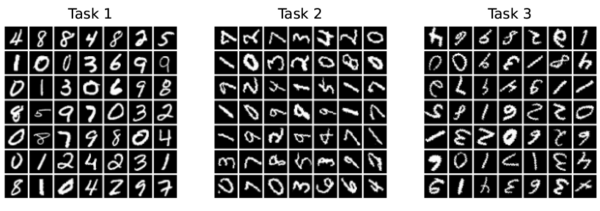
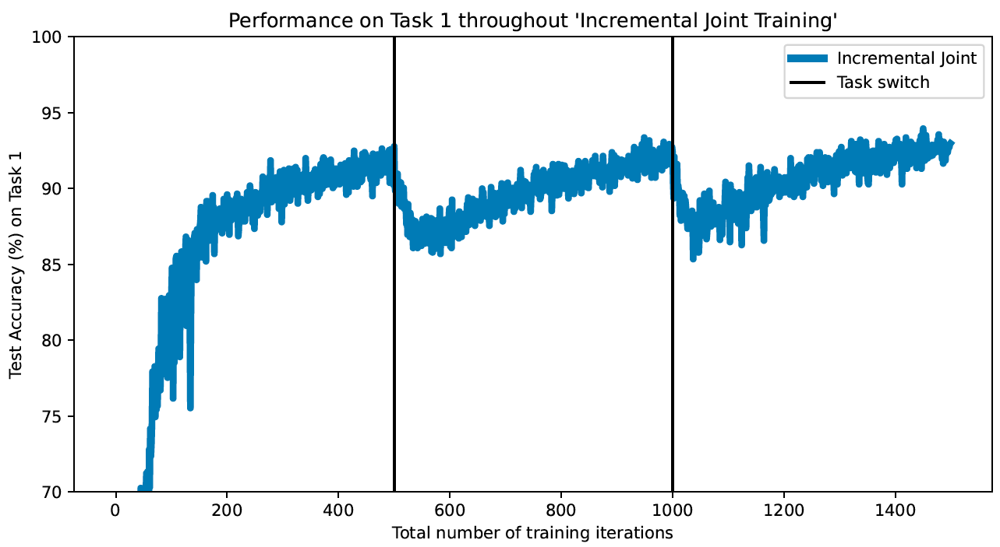

# Stability Gap example

The script `stability_gap_example.py` provides a simple example of the **stability gap** [(De Lange et al.; 2023, *ICLR*)](https://openreview.net/forum?id=Zy350cRstc6). This phenomenon of temporary forgetting can be consistently observed when using state-of-the-art continual learning methods (e.g., replay or regularization) to incrementally train a deep neural network on multiple tasks. Strikingly, as described by [Hess et al. (2023, *ContinualAI Unconference*)](https://proceedings.mlr.press/v249/hess24a.html), the stability gap occurs even with **incremental joint training** (i.e., when training on a new task, all previous tasks are fully retrained as well), which can be interpreted as "full replay" or "perfect regularization".

The example in this script uses **Rotated MNIST** with three tasks (rotations: 0&deg;, 80&deg; and 160&deg;) as the task sequence:

This task sequence is performed according to the domain-incremental learning scenario ([van de Ven et al.; 2022, *Nat Mach Intell*](https://www.nature.com/articles/s42256-022-00568-3)).
A fully-connected neural network (with two hidden layers of 400 ReLUs each) is trained on this task sequence using incremental joint training, while the model's performance on the first task is evaluated after each training iteration.

Running this script should produce a plot similar to:

